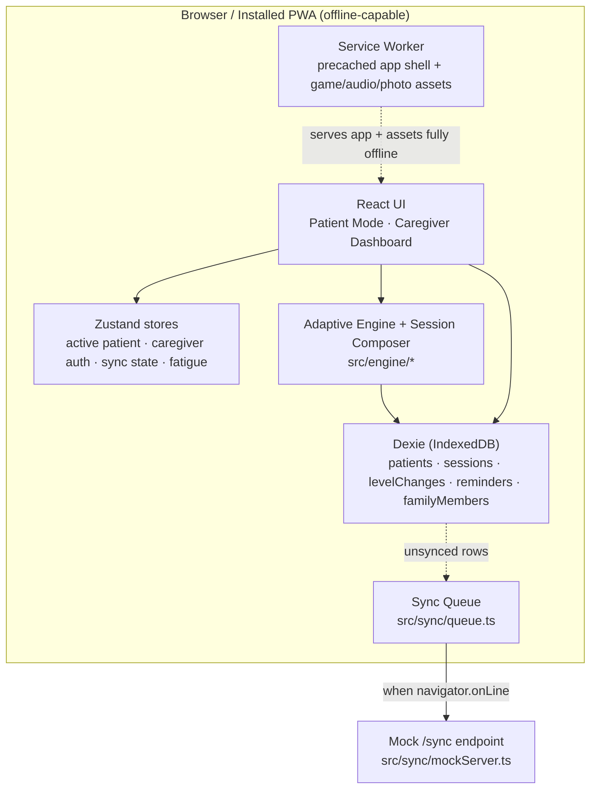

# SmritiSetu — স্মৃতিসেতু — स्मृतिसेतु

**Smriti** (memory) + **Setu** (bridge) — a bridge to memory.

An offline-first, tablet-friendly cognitive-gaming and memory-assistance PWA for elderly
dementia patients in India's North Eastern Region (NER), with a companion caregiver
dashboard. Built for **SIH26003** — *AI-Based Cognitive Gaming and Memory Assistance
Platform for Elderly Dementia Patients in NER* (Smart India Hackathon, Ministry of
Development of North Eastern Region).

> **What this app is and isn't:** SmritiSetu supports cognitive engagement and gives
> families and clinicians a way to track changes over time. **It is not a diagnostic
> tool or a CDSCO/FDA-cleared medical device**, and it does not claim to slow or
> reverse dementia. Please consult a geriatric psychiatrist or neurologist for
> diagnosis and treatment. This line also appears as a persistent footer in the
> caregiver dashboard.

**Live demo:** deploys automatically from `main` via GitHub Actions
(`.github/workflows/deploy.yml`) to GitHub Pages — see the repo's "Deployments" or
Actions tab for the current URL once Pages is enabled (Settings → Pages → Source:
"GitHub Actions", a one-time manual step). CI (`ci.yml`) runs lint, the full test
suite, and a production build on every push and PR.

Deployment notes: link previews use `public/og-image.png` (1200×630) with absolute
URLs built from `SITE_URL` (set by the deploy workflow). A new deploy shows a
"New version available" toast to anyone with the old build open. **The very first
visit to the URL needs a connection** — nothing can be cached before then — after
which the app runs fully offline.

## SIH26003 requirement mapping

Every component the official problem statement asks for is implemented, not aspirational:

| Required (from the SIH26003 problem statement) | Implemented as |
|---|---|
| Interactive cognitive games: memory, attention, daily routine recall, pattern recognition | 14 games across exactly those 4 domains + a bonus orientation domain — see the clinical grounding table below |
| AI/ML algorithms adjusting difficulty based on patient performance | `engine/adaptiveEngine.ts` — explainable rule-based staircase, 10 levels |
| Cognitive performance analytics | `engine/trendAnalysis.ts` — linear-regression trend + z-score anomaly detection, on-device (see below) |
| Multilingual voice-assisted interaction, regional language support, culturally familiar themes | 9 languages (`src/i18n/`) incl. 6 NER-region languages (Manipuri, Khasi, Mizo, Nagamese, Kokborok, Nepali) covering 7 of the 8 official NER states; Web Speech API TTS in `src/lib/speech.ts` — automatically follows whichever language the patient profile is set to; game names rooted in Hindi/Sanskrit with real-language subtitles |
| Medication, hydration, activity, and appointment reminders | `src/reminders/` + the "Today" card on the patient home screen; opt-in local alerts (`notificationService.ts`) fire via the Notification API while the app is open |
| Caregiver monitoring dashboards tracking patient progress | `src/dashboard/` — trend charts, domain balance, adherence, adaptive log, cognitive insights, PDF/CSV export |
| Offline functionality for low-connectivity areas | Dexie/IndexedDB-first reads and writes everywhere, `vite-plugin-pwa` service worker, sync is opportunistic never required |
| Mobile/tablet accessibility with elderly-friendly interface | ≥64px tap targets, ≥18px body text, two high-contrast palettes, zero swipe/double-tap/hard-timer interactions |

## Why offline-first is the core constraint, not a feature

NER has some of the lowest neurologist/geriatric-psychiatrist-to-population ratios in
India, and much of the region's elderly population lives with patchy or no broadband.
Existing cognitive-training apps assume steady connectivity and English/Hindi
literacy — both fail the people this problem statement is about. So every read and
write in this app goes to a local IndexedDB store first; the network is something the
app *opportunistically* talks to when available, never something it depends on to
function.

## Architecture



Every game session writes a `GameSession` row (score, accuracy, response latency, error
types) straight to Dexie. The adaptive engine reads the last 5 attempts at the
patient's current level and decides the next level, logging a human-readable reason to
`levelChanges` — that log is what the caregiver dashboard's "Adaptive Engine Log" shows,
so the level-up/down behavior is auditable rather than a black box.

## Tech stack

React + Vite + TypeScript · Tailwind CSS (custom elderly-accessible design tokens) ·
Dexie.js (IndexedDB) + dexie-react-hooks · Zustand · React Router · Recharts ·
i18next/react-i18next · Web Speech API (TTS + optional speech recognition) · jsPDF
(lazy-loaded, caregiver-only) · `motion` (screen transitions, level-up celebration,
dashboard bar/count-up/typewriter effects — every effect respects
`prefers-reduced-motion`; the spec lives in `.claude/skills/motion-system/SKILL.md`) ·
vite-plugin-pwa · Vitest.

**Dev environment runs in Docker** (`docker-compose.yml` / `Dockerfile.dev`) at the
user's request, so the host machine only needs Docker Desktop, not a matching Node
version.

```bash
docker compose up        # dev server at http://localhost:5173
docker compose run --rm web npm run build   # production build -> dist/
docker compose run --rm web npm run test    # vitest
docker compose run --rm web npm run lint    # oxlint
```

## Clinical grounding — every game maps to a real assessment domain

Each game logs **per-session score, accuracy, average response latency, and error
type** to Dexie — the three numbers the adaptive engine and caregiver dashboard both
consume. Every game screen has an "About this game" (ⓘ) button showing the row below
for that game.

### Domain 1 — Memory *(MoCA delayed recall · ADAS-Cog word recall/recognition)*

| Game | Mechanic | Clinical mapping |
|---|---|---|
| **Smriti Cards** | Culturally-themed picture-pair matching | Visual pair matching → delayed recall & recognition |
| **Smriti Katha** | Listen to a short story, answer recall questions | Episodic/verbal recall via an everyday spoken story, not a word list |
| **Naam Yaad** | See a real family photo, pick the correct name | Personally-meaningful recognition memory, using the patient's own family |

### Domain 2 — Attention & concentration *(MoCA attention/vigilance, digit span, serial subtraction · ADAS-Cog number cancellation)*

| Game | Mechanic | Clinical mapping |
|---|---|---|
| **Dhyan Dhaam** | Tap every tile matching a target pattern, with distractor density | Visual cancellation task |
| **Ginti Dhyan** | Tap numbered tiles in ascending counting order | Digit span / serial subtraction, at an accessible pace |
| **Awaaz Pehchan** | Voice-only: tap only when the pre-announced target word is spoken | Sustained auditory attention/vigilance |

### Domain 3 — Daily routine recall *(instrumental activities of daily living, IADL)*

| Game | Mechanic | Clinical mapping |
|---|---|---|
| **Dinacharya Sequence** | Arrange daily-routine cards into the right order | IADL planning & sequencing |
| **Bazaar List** | Hear a short shopping list, then find those items in a larger grid | Prospective memory & IADL planning |
| **Ghar ka Kaam** | Match a household tool to the task it's used for | Routine-object association |

### Domain 4 — Pattern & object recognition *(MoCA visuospatial/executive · ADAS-Cog constructional praxis)*

| Game | Mechanic | Clinical mapping |
|---|---|---|
| **Aakar Milan** | Pick the shape that completes a repeating pattern | Visuospatial/executive pattern completion |
| **Chaya Khoj** | Match an object to its silhouette among distractor shadows | Pure visuospatial matching, no reading required |
| **Naksha Jodo** | Assemble a picture from large colored pieces | Constructional praxis, a gentler analogue of clock-drawing/figure-copy |

### Domain 5 — Orientation *(bonus domain beyond the problem statement's four; MoCA orientation subtest)*

| Game | Mechanic | Clinical mapping |
|---|---|---|
| **Aaj Ka Din** | Once-daily check-in: what day, what time of day, what season | Temporal orientation. **Does not use the adaptive engine** — it logs correct/incorrect only, since it's a daily check-in, not a difficulty drill |
| **Ghadi Dekho** | Read an analog clock, tap the matching digital time from multiple choices | Visuospatial + temporal orientation — a close analogue of the Clock Drawing Test, one of the most widely used dementia-screening tasks. **Does use the adaptive engine** — the domain's only leveled, repeatable game |

## Adaptive difficulty engine (`src/engine/adaptiveEngine.ts`)

An explainable staircase algorithm, **10 discrete levels** per game:

- Tracks a rolling window of the last **5 attempts** at the patient's current level.
- **Level up** when accuracy ≥ 80% over the window *and* response time is trending
  down (median of the later half of the window ≤ median of the earlier half).
- **Level down** when accuracy < 40% over the window, **or** immediately if error rate
  rose for 2 consecutive sessions (doesn't wait for a full window — a struggling
  patient isn't left failing repeatedly while data accumulates).
- Otherwise holds. Every change is logged with a reason string, e.g. *"leveled up:
  4/5 correct, avg 3.2s"*.
- Reaching level 6+ shows a private "you're getting stronger at this!" acknowledgment
  — never a leaderboard or a comparison against other patients.
- **Extension point:** the module's header comment marks where a per-patient Bayesian
  Knowledge Tracing or logistic-regression model — trained on aggregated, anonymized
  session data across a deployed patient base — could replace the rule-based decision
  without changing anything upstream (session logging, dashboard, UI all call the
  same `decideNextLevel(level, history)` shape).

Unit-tested in `src/engine/adaptiveEngine.test.ts` (13 cases across the level range)
and `src/engine/sessionComposer.test.ts` (6 cases for the "Today's Set" rotation).

## Cognitive analytics (`src/engine/trendAnalysis.ts`)

The adaptive engine above decides *in-game* difficulty. This is a separate, real
statistical-learning layer that answers the caregiver-facing question the problem
statement calls out explicitly — "cognitive performance analytics" — using two
classical, well-established techniques rather than a black box:

- **Ordinary least-squares linear regression** of accuracy over time, per cognitive
  domain, so "is this person actually declining" is answered from the *slope of a
  fitted trend line across all their sessions*, not a fragile today-vs-yesterday
  comparison. The R² of the fit is surfaced alongside the slope, so a noisy, low-R²
  trend is never presented with false confidence.
- **Rolling z-score anomaly detection**, flagging a session that's a statistical
  outlier (|z| ≥ 2) against *that patient's own* recent baseline — never a population
  norm, since this app never sees another patient's data.

Both run instantly on-device against a few dozen data points, need no training phase,
no external dataset, and no network call — the same explainability and offline-first
constraints as the adaptive engine, applied to analytics instead of difficulty. The
caregiver dashboard's **Cognitive Insights** card shows, per domain: Improving /
Stable / Declining / Gathering data, the plain-language reason string the model
computed, and any flagged sessions with a one-line explanation of why they stood out.

Unit-tested in `src/engine/trendAnalysis.test.ts` (9 cases: trend direction, R²
confidence, order-independence, anomaly detection against a stable baseline, and
windowed-vs-whole-history behavior).

## "Today's Set" — avoiding daily monotony

`src/engine/sessionComposer.ts` picks 3 games from 3 different domains each day,
purely off last-played timestamps (no day-of-week math): the domain whose games were
touched longest ago gets picked, and within it, the specific game played longest ago
is featured. This naturally adapts if a patient skips days, rather than assuming daily
play. **Aaj Ka Din** is pinned separately at the top once per day until completed,
since it's a check-in, not part of the rotation.

## Accessibility (hard requirements, not polish)

- Body text ≥ 18px, primary actions 22–24px, with a caregiver-toggleable extra-large
  mode up to ~28px (implemented by scaling the document root font-size, so every
  rem-based size — including tap targets — scales together).
- Minimum 64×64px tap targets, 16px+ spacing.
- Two WCAG-AAA-targeted high-contrast palettes (`src/index.css`): a default warm
  cream/teal/saffron palette, and an alternate blue/amber palette that avoids
  red/green cues for common elderly color-vision changes. Both palettes' focus
  indicator is amber, deliberately never blue — age-related lens yellowing reduces
  blue discrimination, making blue one of the worse choices for a focus ring in
  this specific population.
- No swipe gestures, no double-tap, no auto-advancing carousels, no hard timers that
  fail the patient. The two placement-style games (Dinacharya Sequence, Naksha Jodo)
  use **tap-to-place with tap-to-undo** rather than continuous drag — a deliberate
  accessibility call: sustained drag tracking is measurably harder than a discrete tap
  for users with tremor or motor-precision changes, while the task (arrange items
  correctly, forgiving, no time pressure, undo always available) is unchanged.
- One task per screen, no menu nested more than 2 levels, an always-visible home
  button (`GameShell`).
- Session-length nudge: after ~11 minutes or 4 games since the patient last chose to
  keep playing, a gentle "take a break?" prompt appears (`BreakPromptWatcher` +
  `fatigueStore`) — this is patient-fatigue protection, not an engagement metric, and
  is never reported to the caregiver dashboard as a KPI.

## Multilingual & voice support

- **High-resource, native-quality UI translations:** English, Hindi, Assamese
  (`src/i18n/{en,hi,as}.json`).
- **Full-structure translations for six North Eastern Region languages** — Manipuri
  (Bengali script — see that file's `_meta.scriptChoice` for why, and why it isn't
  settled), Khasi, Mizo, Nagamese, Kokborok, Nepali
  (`src/i18n/{mni,kha,lus,nsm,kok,ne}.json`), covering 7 of the 8 official NER
  states (only Arunachal Pradesh, whose extreme linguistic diversity makes a single
  representative language a genuinely hard call, is left to the English/Hindi
  fallback). Every key in the UI (including all 14 game names/taglines/instructions)
  has a translation, but each file is flagged with a `_meta.status` note: these are
  AI-assisted best-effort drafts, not yet reviewed by a native speaker or community
  linguist — confidence varies within the group too (Nepali is comparatively
  well-documented; Kokborok has far fewer digital resources and its `_meta.status`
  says so explicitly). Any key that's still missing anywhere falls back to English
  automatically (`i18n/index.ts`).
- **The selected language drives TTS automatically, not just UI text.** Changing a
  patient's `preferredLanguage` (onboarding, or Settings) changes both at once —
  `VoicePrompt` always speaks in `patient.preferredLanguage`, and `<html lang>` stays
  in sync too (`i18n/index.ts`'s `languageChanged` listener) — there's no separate
  "TTS language" setting to keep in sync by hand, by construction.
- **TTS is opt-in everywhere, never automatic.** A speaker-icon button next to the
  relevant text reads it aloud on tap via `SpeechSynthesisUtterance`; it never plays
  on its own when a screen loads. If no matching voice is installed (Nepali has
  genuine broad device support; most of the other NER-region languages don't yet),
  it falls back to a pre-recorded clip path and then to English TTS — audio never
  blocks the tap targets underneath it (`src/lib/speech.ts`).
- **Smriti Katha, Awaaz Pehchan, and Aaj Ka Din are voice-first**: fully playable with
  audio alone and tap-only responses, zero required reading.
- **Known limitation:** bespoke game *content* (the 3 Smriti Katha stories, the word
  pool for Awaaz Pehchan) is English-only in this build — translating narrative
  content well needs native-speaker review, not machine translation, so it's flagged
  here rather than shipped silently. UI chrome around that content is fully
  localized.

## Offline-first, demoable

- All reads/writes hit Dexie first; nothing blocks on network.
- `src/sync/queue.ts` batches unsynced `sessions`/`reminderLogs`, retries with
  exponential backoff, and fires opportunistically (interval, `online` event, and
  once on load).
- The caregiver dashboard's **Offline / Sync Demo panel** has an "airplane mode"
  toggle that overrides `navigator.onLine` for the whole app — play a game or mark a
  reminder while it's on, then flip it off and watch the badge go
  Offline → Syncing → Synced and a mock request actually land
  (`src/sync/mockServer.ts`, with a running received-count so it's visibly not a
  no-op).
- All game assets are code-split per game and precached by the service worker
  (`vite-plugin-pwa`), verified via `docker compose run --rm web npm run build`
  producing per-game chunks (see build output — each game is ~2–6KB gzipped).

## Admin Panel (`/admin`, `src/admin/AdminOverview.tsx`)

A third, PIN-gated role alongside patient and caregiver, for the person who set up
a device or manages several patients (a family running more than one profile on a
shared tablet, or a clinic/NGO deployment):

- The caregiver who completes first-time onboarding on a device is automatically
  the admin for that install (`role: 'admin'` on their `Caregiver` record) — there's
  no separate signup step. Auth is a separate in-memory session
  (`store/adminAuthStore.ts`) from the caregiver dashboard's, gated by its own PIN
  entry (`/admin/login`), reusing the same `PinPad` component (with the same
  5-attempt lockout) as caregiver login.
- **Patients:** every patient record on the device, with a session count and a
  one-tap "Set Active" switch — this is what turns the "single active patient"
  limitation into a real multi-patient switcher. "Add Patient" creates another
  profile without re-running onboarding.
- **Caregivers:** every caregiver record, their role, and a "Reset PIN" action that
  generates a new random PIN, hashes and stores it, and shows the plaintext PIN once
  (never persisted or logged in the clear).
- **Languages:** a read-only status view of `SUPPORTED_LANGUAGES`, useful for a
  deployment to quickly see which languages are fully wired up.
- **Data tools:** a one-click JSON export of every table (caregiver PIN hashes are
  deliberately excluded from the export — a backup file is not the place for auth
  material), and a "Danger Zone" full data reset gated behind typing a literal
  confirmation word, not just a click, before it does anything irreversible.

The entry point is a small, deliberately unobtrusive text link on the role-select
screen (`RoleSelect.tsx`) — not a third big button next to "I want to play" /
"I am a caregiver", so it doesn't add a confusing extra choice to the one screen a
patient with cognitive impairment sees on every app launch.

**The panel is off in production builds.** The `/admin` routes and that link are
only registered when `ADMIN_ENABLED` is true (`src/lib/featureFlags.ts`): always in
the dev server, and in a production build only if it was built with
`VITE_ENABLE_ADMIN=true`. The reason is the "Forgot PIN" flow, which (like the
caregiver one) lets anyone on the device set a new PIN with no proof of identity —
acceptable for the caregiver gate, not for a panel that can reset every caregiver
PIN and wipe all data. In a build without the flag, `/admin` falls through to the
catch-all and redirects home, so the public demo never exposes it.

## Data model (Dexie, `src/db/schema.ts` / `src/db/types.ts`)

Matches the brief closely, with two small additions: a `reminderLogs` table (so
adherence can be computed per-day, not just "last acknowledged"), and per-patient
`highContrastPalette`/`textScale` fields (the caregiver-toggleable accessibility
settings need somewhere to live).

## Known limitations (naming our own gaps)

- **Placeholder art, not commissioned regional artwork.** Smriti Cards' culturally-themed
  pairs are line icons from the shared SVG sprite (`IconSprite.tsx` — the app uses no
  emoji); Aakar Milan uses geometric glyphs; Chaya Khoj derives "shadows" by
  CSS-blackening (`brightness(0)`) the same sprite icons; Naksha Jodo assembles a generated
  radial color mosaic rather than a literal bamboo-hut/boat/mountain illustration.
  All are functionally real cognitive tasks, but the visuals are a hackathon
  stand-in for hand-drawn or photographed regional motifs (gamosa/jaapi/Naga shawl
  patterns, real silhouette photography, a real tangram of a bamboo hut).
- **Single active patient per device at a time**, matching the primary use case in
  the problem statement, but the data model always supported more than one patient
  record — the Admin Panel (below) now exposes that as a real patient switcher for
  households or institutions running SmritiSetu across several patients on one
  tablet.
- **PIN auth is a lightweight gate**, not a security boundary — it keeps a patient
  from wandering into the dashboard or admin panel, not a defense against a
  determined adult. PINs are salted (per-caregiver, via `crypto.getRandomValues`)
  and hashed (SHA-256) before storage (`src/lib/pin.ts`), and a short lockout after 5
  wrong attempts discourages idle keypad-mashing, but this is still not meant to
  resist a determined attacker with device access.
- **The `/sync` backend is mocked** (`src/sync/mockServer.ts`) — it simulates
  latency and keeps a local received-count, so the offline→online flow is fully
  demoable, but there's no real server persisting data across devices yet.
- **No encryption at rest.** IndexedDB (via Dexie) stores patient data in plaintext
  on-device — reasonable for a single-device hackathon prototype, but a real clinical
  deployment handling health-adjacent data under India's DPDP Act 2023 would need
  device-level encryption (OS full-disk encryption today; app-level encryption as a
  roadmap item).
- **Component/integration test coverage is representative, not exhaustive.**
  `engine/` has full unit coverage; a cross-section of the riskiest UI surfaces
  (the error boundary, the onboarding consent gate, the cognitive-insights card, and
  one full game end-to-end) has component tests via React Testing Library, but not
  all 14 games do yet.
- **TTS voice coverage depends entirely on the device.** Hindi and English are
  reliable on most Android/Chrome devices; Assamese support is inconsistent; the four
  North Eastern Region languages fall back to English audio (flagged, not hidden).
- **The in-game adaptive engine is a rule-based staircase, deliberately** — it needs
  zero training data and runs fully on-device, which matters for an offline-first app.
  The extension point for a learned model is real (see above), not aspirational
  filler. The separate cognitive-analytics layer (`trendAnalysis.ts`) *is* genuine
  statistical learning (linear regression + anomaly detection) — the two are
  complementary, not the same thing wearing different names.

## Roadmap

1. Native-speaker/community review of the six North Eastern Region language
   translation files (they're structurally complete but AI-assisted and unreviewed —
   Kokborok most urgently, given how few digital resources exist for it), and a
   decision (with community input, not just engineering convenience) on Meitei
   Mayek vs. Bengali script for Manipuri.
2. Replace placeholder visuals with commissioned regional artwork per game.
3. Real backend for `/sync` with per-clinic or per-family account boundaries, feeding
   the same multi-patient Admin Panel that already exists client-side.
4. **Partially done:** local (non-push) reminder alerts now exist
   (`src/reminders/notificationService.ts`, opt-in from Settings) — they fire via the
   Notification API while the app/tab is open, including backgrounded, but can't wake
   a fully closed browser. True background push (via a real `/sync` backend) is the
   remaining step for a reminder to arrive even after the tablet's browser was closed.
5. A small aggregated, anonymized cross-patient dataset (with consent) to prototype
   the Bayesian Knowledge Tracing extension point in `adaptiveEngine.ts`.
6. A real clinical pilot with a geriatric psychiatrist partner to validate the
   domain mappings and adaptive thresholds against MoCA/ADAS-Cog scores over time —
   the dashboard's trend data is designed for exactly this conversation.
